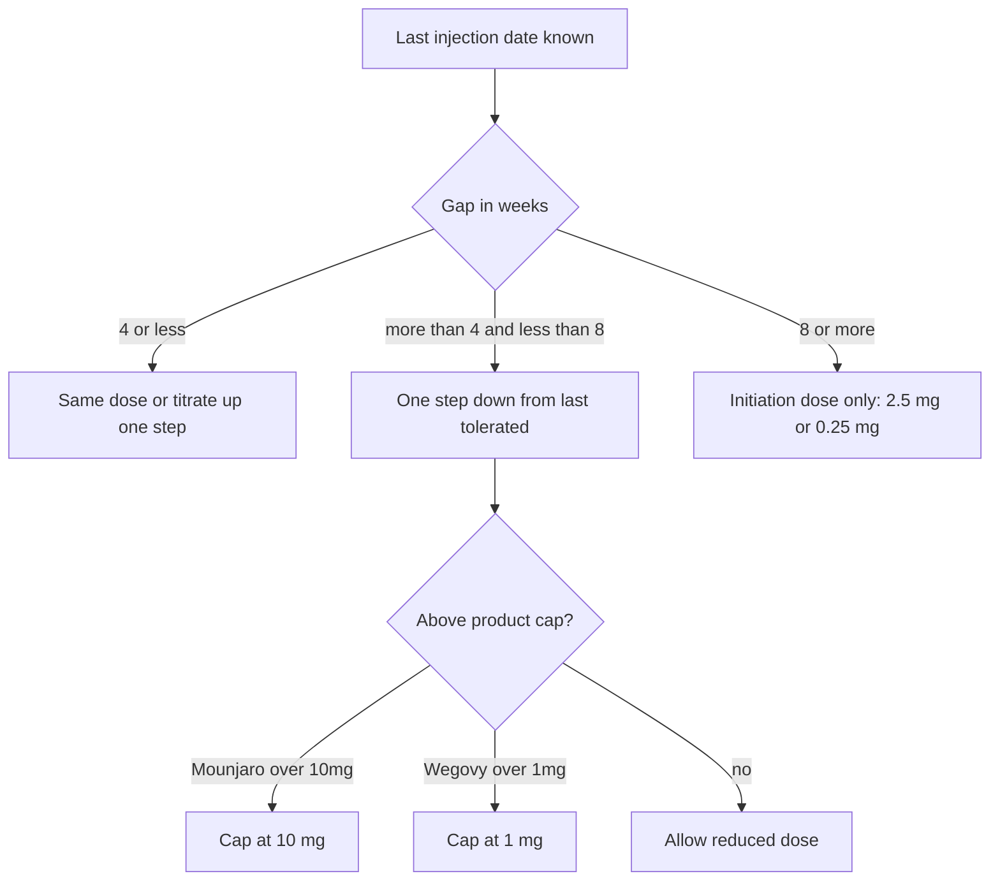

# Injectable consultation rules (Mounjaro / Wegovy)

Rules-only handoff for developers. Every question, every option, and what it does to **eligibility (rejection)** or **allowed strength (dose)**.

**Related:** [ORLISTAT-CONSULTATION-RULES.md](ORLISTAT-CONSULTATION-RULES.md) (oral tablets — different rejection model).

---

## Legend

| Term | Meaning |
|------|---------|
| **Continue** | Patient may proceed — no automatic rejection |
| **Reject** | Patient cannot continue online — show ineligible screen with reason |
| **Prompt** | Extra question before continuing (step 98 — prior Mounjaro/Wegovy use) |
| **Collect** | Record answer for clinical review — does not auto-reject |
| **Dose rule** | Changes which strengths the patient may select on the treatment plan step |

**Injectable rejection is immediate** — patient sees why they were rejected (unlike Orlistat, which defers to the end).

---

## Consultation flow (overview)

```
Steps 1–16
  After step 8 or 9 → any hard-stop answer → Reject
  After step 9 (new patient only) → BMI rules → Reject, Prompt, or Continue
  Step 98 (if prompted) → Yes = continue as transfer; No = Reject
  Step 15 → gap rules restrict which pen strengths are selectable
```

Logged-in patients skip the contact-details step.

---

## Journey type (step 3)

**Question:** *Where are you in your weight loss journey?*

| Option | Effect |
|--------|--------|
| **New patient** — starting treatment | New-patient BMI rules apply; starter doses only if eligible |
| **Existing patient** — reorder | Uses prior treatment from record; repeat safety questions |
| **Transferring** — from another provider | Transfer medication details + **gap dose rules** apply |

**Re-routing:**

- New patient who answers **No** to “new to injectables?” on step 10 → treated as **transfer**
- Step 98 **Yes** (taken Mounjaro/Wegovy before) → treated as **transfer**, skip back to medication step

---

# Automatic rejection (hard stops)

These **always reject** when the patient tries to continue after step 8 or 9. Show the ineligible screen with the reason.

| # | Trigger | Question / source |
|---|---------|-------------------|
| 1 | Age **under 18** or **over 75** | Date of birth (step 5) |
| 2 | **Pregnant, breastfeeding, or planning** pregnancy/breastfeeding | Step 8 — female or prefer-not-to-say only |
| 3 | **GLP-1 allergy** (Wegovy, Mounjaro, Ozempic, Saxenda, etc.) | Step 8 — answer **Yes** |
| 4 | **MTC or MEN2** (personal or family history) | Step 9 — condition selected |
| 5 | **Eating disorder** (anorexia or bulimia) | Step 9 — condition selected |
| 6 | BMI **below 25** | New patient only — after step 9 |
| 7 | Step 98 — **No** to prior Mounjaro/Wegovy use | After BMI prompt |

---

# BMI rules — new patients only

Does **not** apply to existing reorder or transferring patients (unless gap &gt; 8 weeks forces initiation dose — see gap rules).

### Thresholds (“lowest threshold wins”)

| Patient factor | Minimum BMI to qualify as new starter |
|----------------|--------------------------------------|
| White ethnicity | **30** |
| BAME ethnicity (Asian, Black, Middle Eastern, Mixed, Other) | **27** |
| Answered **Yes** to step 9 gate *“diagnosed with or had surgery for any of the following?”* | **27.5** |
| Prefer not to say + step 9 gate **No** | **30** |
| Absolute floor (anyone) | **25** — below this = **Reject** |

### Outcomes after step 9 (new patient)

| BMI | Outcome |
|-----|---------|
| **Below 25** | **Reject** |
| **25 up to (but not including) eligible threshold** | **Prompt** step 98 — *Have you taken Mounjaro or Wegovy before?* |
| **At or above eligible threshold** | **Continue** — may only select **starter strength** on plan step |

### Step 98 prompt

**Question:** *Not eligible as a new starter. Have you taken Mounjaro or Wegovy before?*

| Answer | Outcome |
|--------|---------|
| **Yes** | **Continue** as transfer — gap dose rules apply; proof of prior prescription/BMI may be required |
| **No** | **Reject** — “Not suitable.” |

### Examples

| Patient | BMI | Step 9 gate | Threshold | Result |
|---------|-----|-------------|-----------|--------|
| White, no conditions gate | 32 | No | 30 | Continue (starter dose) |
| White, no conditions gate | 28 | No | 30 | Prompt (step 98) |
| White, no conditions gate | 24 | No | 30 | Reject |
| BAME, no conditions gate | 27 | No | 27 | Continue |
| BAME, no conditions gate | 26 | No | 27 | Prompt |
| Any, conditions gate Yes | 28 | Yes | 27.5 | Continue |

### New patient — allowed strengths on plan step

If eligible as new starter, patient may **only** select:

| Product | Only allowed strength |
|---------|----------------------|
| Mounjaro | **2.5 mg** |
| Wegovy | **0.25 mg** |

No higher strengths selectable for brand-new starters.

---

# Treatment gap rules (dose adjustments)

**Applies when:** transferring patient, restart after step 98 Yes, or new patient who has used injectables before.

**Inputs needed:** product (Mounjaro or Wegovy), **last tolerated dose**, **last injection date** (gap = whole weeks from last injection to today).

> Gap duration determines the maximum permitted restart dose. Side effects are managed separately and do **not** change these restart doses.

### Summary (three bands)

| Gap since last injection | Allowed action | Mounjaro maximum | Wegovy maximum |
|--------------------------|----------------|------------------|----------------|
| **4 weeks or less** | Continue **same dose** OR **titrate up** one step as normal | Next step on ladder (no cap below prior rules) | Next step on ladder |
| **More than 4 weeks, less than 8 weeks** | **Reduce by one dose step** from last tolerated | **10.0 mg** cap | **1.0 mg** cap |
| **8 weeks or more** | **Must restart at initiation dose** | **2.5 mg** only | **0.25 mg** only |

**Initiation dose** = lowest step on the ladder (Mounjaro 2.5 mg, Wegovy 0.25 mg).

Patient may always choose a **lower** dose than the maximum allowed.

---

### Dose ladders

**Mounjaro (mg):** 2.5 → 5 → 7.5 → 10 → 12.5 → 15  

**Wegovy (mg):** 0.25 → 0.5 → 1 → 1.7 → 2.4

---

### Gap 4 weeks or less

- Patient may stay on **same dose** or move **up one step** on the ladder (normal titration).
- No forced step-down.

---

### Gap more than 4 weeks, less than 8 weeks

- Patient must go **one step lower** than their last tolerated dose.
- Result is **capped** at:
  - Mounjaro **10 mg**
  - Wegovy **1 mg**

**Mounjaro — last tolerated dose → permitted maximum after gap rule**

| Last tolerated dose | One step down | After 10 mg cap |
|---------------------|---------------|-----------------|
| 2.5 mg | 2.5 mg (already lowest) | 2.5 mg |
| 5 mg | 2.5 mg | 2.5 mg |
| 7.5 mg | 5 mg | 5 mg |
| 10 mg | 7.5 mg | 7.5 mg |
| 12.5 mg | 10 mg | **10 mg** |
| 15 mg | 12.5 mg | **10 mg** |

**Wegovy — last tolerated dose → permitted maximum after gap rule**

| Last tolerated dose | One step down | After 1 mg cap |
|---------------------|---------------|----------------|
| 0.25 mg | 0.25 mg | 0.25 mg |
| 0.5 mg | 0.25 mg | 0.25 mg |
| 1 mg | 0.5 mg | 0.5 mg |
| 1.7 mg | 1 mg | **1 mg** |
| 2.4 mg | 1.7 mg | **1 mg** |

---

### Gap 8 weeks or more

- **Everyone** restarts at **initiation dose only** — regardless of what they were on before.
- Mounjaro: **2.5 mg** only selectable
- Wegovy: **0.25 mg** only selectable

*(Reference dose-step table: all prior steps at ≥8 weeks gap map to initiation / step 2 in clinical protocol.)*

---

### Gap rules flowchart



---

# Question-by-question rules

## Step 1 — Intro

| Item | Effect |
|------|--------|
| Start consultation | Continue |

---

## Step 2 — Contact (guests only)

| Question | Any valid answer | Effect |
|----------|------------------|--------|
| Full name | — | Collect |
| Email | — | Collect |
| Phone | — | Collect |

---

## Step 4 — Ethnicity

| Option | Effect on rules |
|--------|-----------------|
| Asian or Asian British | BAME BMI threshold **27** |
| Black, African, Caribbean or Black British | BAME **27** |
| Middle Eastern | BAME **27** |
| Mixed or multiple ethnicities | BAME **27** |
| White | White BMI threshold **30** |
| Other ethnic group | BAME **27** |
| Prefer not to say | Default threshold **30** (unless step 9 gate lowers it) |

---

## Step 5 — Date of birth, height, weight

| Item | Effect |
|------|--------|
| Date of birth | Age calculated — **Reject** if under 18 or over 75 |
| Height + weight | BMI calculated and displayed (number only) |
| BMI value | Used in new-patient rules and gap rules |

---

## Step 6 — Medical history (comorbidities)

**Gate:** *Have you ever been diagnosed with any of the following?*

| Gate answer | Effect |
|-------------|--------|
| **No** | Continue |
| **Yes** | Must pick at least one condition below |

**If Yes — each condition (all Collect only, no auto-reject):**

| Condition | Reject? |
|-----------|---------|
| Prediabetes | No |
| Type 2 diabetes | No |
| High blood pressure | No |
| High cholesterol | No |
| Heart or blood vessel disease | No |
| Previous stroke | No |
| Obstructive sleep apnoea | No |
| Acid reflux / GORD (on regular medication) | No |
| MASLD / NAFLD | No |
| Osteoarthritis | No |
| Depression (on regular medication) | No |
| Erectile dysfunction | No |
| PCOS | No |

> Step 6 conditions do **not** lower the BMI threshold. Only step 9 gate **Yes** applies the 27.5 comorbidity BMI band.

---

## Step 7 — High-risk medications

**Gate:** *Are you currently taking any of the following medications?*

| Gate answer | Effect |
|-------------|--------|
| **No** | Ask: stopped any in past 3 months? → Collect either way |
| **Yes** | Must select at least one — **none auto-reject** |

**If Yes — each medication (all Collect only):**

Amiodarone, Carbamazepine, Ciclosporin, Clozapine, Digoxin, Fenfluramine, Insulin, Lithium, Mycophenolate mofetil, Oral methotrexate, Phenobarbital, Phenytoin, Somatrogon, Tacrolimus, Theophylline, Warfarin.

| Stopped in past 3 months? | Reject? |
|---------------------------|---------|
| Yes / No | No |

---

## Step 8 — Your health

| Question | Answer | Effect |
|----------|--------|--------|
| Sex assigned at birth | Male | Continue — pregnancy questions skipped |
| | Female / Prefer not to say | Show pregnancy + OCP questions |
| Pregnant, breastfeeding, or planning? | **Yes** | **Reject** |
| | No | Continue |
| Oral contraceptive? | Yes / No | Collect |
| GLP-1 allergy? | **Yes** | **Reject** |
| | No | Continue |

---

## Step 9 — Medical conditions

**Block A — Gate:** *Have you been diagnosed with or had surgery for any of the following?*

| Gate answer | Effect |
|-------------|--------|
| **No** | Continue — no 27.5 BMI band from this question |
| **Yes** | Applies **27.5 BMI threshold**; must select at least one condition |

**If Yes — each condition:**

| Condition | Reject? |
|-----------|---------|
| Pancreatitis | No — Collect |
| Type 1 diabetes | No — Collect |
| **Eating disorder** (anorexia or bulimia) | **Yes — Reject** |
| Gallbladder issues | No — Collect (+ surgery timing if applicable) |
| Weight-loss surgery in last 12 months | No — Collect |
| Liver disease or impairment | No — Collect |
| **MTC or MEN2** | **Yes — Reject** |
| Cancer under specialist treatment | No — Collect |
| Diabetic retinopathy / NAION | No — Collect |
| Heart failure at rest | No — Collect |

**Block B — Other medical conditions**

| Question | Answer | Reject? |
|----------|--------|---------|
| Any other medical conditions? | No | No |
| | Yes (+ details) | No — Collect |

**After step 9 (new patient only):** apply BMI table above → Reject, Prompt, or Continue.

---

## Step 10 — Medication & safety (varies by journey)

### New patient — “Are you new to injectable weight-loss medications?”

| Answer | Effect |
|--------|--------|
| **Yes** | Continue to next steps |
| **No** | Collect transfer details (product, last dose, last injection date) → **gap dose rules** apply on plan step |

### Transferring patient

| Item | Effect |
|------|--------|
| Changes since last review? | Collect |
| Side effects? | Collect |
| Hospitalised due to weight-loss medication? | Collect |
| Product, last strength, last injection date | **Drives gap dose rules** |

### Existing patient (reorder)

| Item | Effect |
|------|--------|
| Changes since last review? | Collect |
| Hospitalised? | Collect |
| Side effects since last order? | Collect |
| Prior plan from record | Plan step may be skipped |

---

## Steps 11–14

| Step | Content | Reject? |
|------|---------|---------|
| 11 | Optional notes for clinical team | No |
| 12 | Agreement / declarations | Must accept to continue |
| 13 | GP consent + details | No |
| 14 | ID, video, prescription uploads | No — may be required for transfer/restart proof |

**Uploads often required for transfer / step 98 Yes:**

| Situation | Documents |
|-----------|-----------|
| Transfer patient requesting above starter dose, or BMI below threshold | Previous prescription |
| Transfer on Mounjaro above 2.5 mg with BMI below threshold | Previous BMI verification |

---

## Step 15 — Treatment plan (strength selection)

| Journey | Allowed strengths |
|---------|-------------------|
| **New patient** (eligible) | Mounjaro **2.5 mg** or Wegovy **0.25 mg** only |
| **Transfer / restart** | Per **gap dose rules** above — only permitted steps selectable |
| **Existing reorder** | Prior plan (may skip this step) |

If gap rules allow no selectable strength (e.g. missing last injection date), patient cannot complete plan until data provided.

---

## Step 16 — Add-ons and submit

| Item | Effect |
|------|--------|
| Optional add-ons | Collect |
| Password (guests) | Required to submit |
| Submit | End consultation |

---

# Master rejection checklist

| Cause | Step |
|-------|------|
| Age &lt; 18 or &gt; 75 | 5 → enforced 8/9 |
| Pregnancy / breastfeeding / planning | 8 |
| GLP-1 allergy | 8 |
| MTC or MEN2 | 9 |
| Eating disorder | 9 |
| BMI &lt; 25 (new patient) | 9 |
| Step 98 No (never used Mounjaro/Wegovy) | 98 |

---

# Master dose-rule checklist

| Situation | Mounjaro | Wegovy |
|-----------|----------|--------|
| New starter eligible | 2.5 mg only | 0.25 mg only |
| Gap ≤ 4 weeks | Same or +1 step | Same or +1 step |
| Gap &gt; 4 and &lt; 8 weeks | One step down, max **10 mg** | One step down, max **1 mg** |
| Gap ≥ 8 weeks | **2.5 mg** only (initiation) | **0.25 mg** only (initiation) |

---

# Does NOT auto-reject

- Any step 6 comorbidity
- Any step 7 high-risk medication
- Step 9 conditions except **MTC/MEN2** and **eating disorder**
- Step 9 other conditions free text
- Stopped high-risk meds in past 3 months
- Oral contraceptive use
- Ethnicity choice alone

---

*Injectable weight-loss consultation — Mounjaro & Wegovy. Gap rules updated: ≤4 weeks titrate normally; &gt;4–&lt;8 weeks one step down (10 mg / 1 mg cap); ≥8 weeks initiation dose only.*
